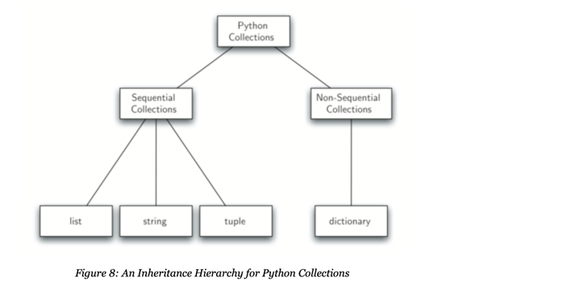

# 1. Introduction

## 1.3 What is Computer Science?
  * the study of problems, problem solving, and solutions from the problem solving process
  * a study of algorithms
    * def **algorithm**: n.finite processes that if followed will solve a problem
  * the study of problems that are and that are not computable 
    * def **computable**: adj. having an existing algorithm that can solve it [a problem]
  * the study of **abstraction** of problems and algorithms
    * e.g user interfaces, the use of libraries to reuse solutions without knowing all the details

### 1.3.1 Algorithms
In the context of most applications (especially coding interviews), algorithms should be:
* deterministic: given same input, should always return same output (no randomness)
* returns correct answer for any arbitrary valid input

## 1.4 What is Programming?
  * writing an algorithm into a programming language, to be executed by a computer
  * creating the representation on our solutions

## 1.5 Why Study Data Structures and Abstract Data Types
  * Help simplify problems and problem-solving process, to effectively understand and manipulate them
  *  **abstract data type**: logical description of data members and operations disregarding implementation
  * **data structure**: the implementation of an abstract data type

## 1.6 Why Study Algorithms
  * algorithms can act as a set of techniques for solving known problems, to help us solve new problems
  * develop better pattern recognition so better understand how to solve the next problem
  * to be able to compare algorithms and figure out the better or best solution
  * to distinguish solvable from unsolvable problems

## 1.8 Atomic Data Types

### 1.8.1 Numeric Data Types
* int
* float

| Operator | Description                                     |
|----------|-------------------------------------------------|
| x+y      |                                                 |
| x-y      |                                                 |
| x*y      | multiplication                                  |
| x//y     | integer division, returns truncated integer     |
| x/y      | floating point division, returns floating point | 
| x%y      | modulo, remainder                               |
| x*y      | exponentiation                                  |


### 1.8.1 Boolean Data Type
  * bool: value is either True or False

| Operator | Description                     |
|----------|---------------------------------|
| x<y      | less than                       |
| x>y      | greater than                    |
| x<=y     | less than or equal to           |
| x>=y     | greater than or equal to        |
| x==y     | equal to                        |
| x!=y     | not equal                       |
| x and y  | and (both True)                 |
| x or y   | inclusive or (one or both True) |
| not x    | negation (not True)             | 

## 1.8.2 Built-in Collection Data Types
  * list: mutable sequence of references to Python data objects
  * strings: immutable sequence of chars
  * tuples: immutable sequence of data objects 
  * dictionaries: unordered collection of key-value pairs
  * sets: unordered collection of unique data objects

### Ordered Collections (aka Sequences) 

```python
myList = [1.5,1,"cat",True]
myString = "I am a string"
myTuple = (1,False,"kitty")
```

| Operator | Description                                                 |
|----------|-------------------------------------------------------------|
| [ ]      | indexing; access i<sup>th</sup> element in sequence         |
| +        | concatenation; join two sequences together                  |
| *        | repetition; join copies of the same sequence i times        |
| in       | membership; return bool for whether item is in the sequence |
| len()    | length; returns number of items in the sequence             |
| [i:j]    | slicing; return the i<sup>th</sup> to j<sup>th</sup> item   |

### Sets

```python
mySet = {3,6,"cat",4.5,False}
```

| Operator   | Description                                                       |
|------------|-------------------------------------------------------------------|
| in         | membership; return True if item in set, else False                |
| len()      | length; number of items in set                                    |
| x &#124; y | union; returns new set with all elements from set x and y         |
| x & y      | intersection; returns new set with elements common to set x and y |
| x-y        | difference; returns new set with all items in set x not in set y  |
| x <= y     | subset; returns bool of whether x is subset of y                  |

### Dictionaries

```python
capitals = {'Iowa':'DesMoines','Wisconsin':'Madison'}
```

| Operator         | Description                            |
|------------------|----------------------------------------|
| myDict[key]      | get value for key in dict              |
| key in myDict    | return True if key in dict, else False |
| del myDict[key]  | delete key from dict                   |

## 1.9.1 String Formatting

#### Using print()

```commandline
>> aName = "Mary"
>> age=19
>> print("%s is %d years old." % (aName, age))
Mary is 19 years old

>>name = {'first': Mary, 'last': Sue }
>> print("No one is more hateable than a %(first)s %(last)s "%name)
```

| Format Operator | Description                                               |
|-----------------|-----------------------------------------------------------|
| %d, %i          | integer                                                   |
| %u              | unsigned integer                                          |
| %f              | floating point as m.ddddd                                 |
| %e              | floating point as m.ddddde+/-xx                           |
| %E              | floating point as m.dddddE+/-xx                           |
| %c              | single character                                          |
| %s              | string                                                    |
| %%              | literal %                                                 |
| %03d            | left padded with 0's for total length of 3 digits         | 
| %20s            | value in 20 char wide field                               |
| %-20s           | value in 20 char wide field, left justified               |
| %+20s           | value in 20 char wide field, right justified              |
| %20.2f          | value in 20 char wide field, with 2 char right of decimal |
| %(key)s         | get value from dictionary                                 |

## Control Structures

Two Types of Control Structures:
  * Iteration/loops e.g while, for
  * Selection e.g if-else statements


### While Loops

```python
counter = 1
while counter <= 5:
    print("Iteration #%d"%counter)
    counter += 1
```

### For Loops
  * iterates over a collection

```python
for counter in [1,2,3,4,5]:
    print("Iteration #%d"%counter)

for counter in range(1,5):
    print("Iteration #%d"%counter)
```

### If-else Statements

```python
temperature=100
if temperature < 0:
    print("Frigid")
elif temperature < 60:
    print("Cold")
elif temperature < 90:
    print("Temperate")
else:
    print("Hot")
```

### Comphrehensions
  * allows you to generate a collection using one-line control structures

```commandline
>>> [2*x for x in range(1,5)]
[2,4,6,8,10]
```

## Exception Handling

Types of errors:
  * Syntax error: mistake violating languages's rules and resulting in runtime error
  * Logic error: program executes but has unexpected behavior that can lead to runtime error

* def Exceptions: runtime errors that result from logic errors
  * programmers can "handle" exceptions, deciding how program will continue executing in spite of them
  * programmers can also "raise" exceptions to force a runtime error in certain use cases


### Try-Except Block
  * to handle exceptions

```python
import math

try:
    anumber = -3
    print(math.sqrt(anumber))
except RuntimeError as e:
    print("Bad Value for square root")
    print("Using absolute value instead")
    print(math.sqrt(abs(anumber)))
```

### Raise Exception

```python
import math

anumber = -3
if anumber < 0:
    raise RuntimeError("Negative numbers are forbidden")
else:
    print(math.sqrt(anumber))
```

## 1.12 Functions

```python
def square(n):
    return n**2
```

## 1.13 Object-Oriented Programming
## 1.13.1 Classes
  * classes allow programmers to implement an abstract data type by defining members and methods

```commandline
class Fraction:
    def __init__(self, num, den):
        self.num = num
        self.den = den
    
    
    def __str__(self):
    """
    Overrides built-in method __str__ so program implements your function below instead
    """
        return f"{self.num}/{self.den}"
        
        
a = Fraction(1,2) #creates a fraction object
print(a) #prints "1/2"
```

See [fractions.py in exercises folder](./exercises/fractions.py) for full implementation of Fraction class

### Shallow vs Deep Equality

* **shallow equality**: when object o1 and o2 reference the same object, o1 == o2
* **deep equality**: when object o1 and o2 don't reference the same object but have the same value o1 == o2


## 1.13.2 Inheritance
  * key feature of object oriented programming
  * allowing child classes to inherit methods and members from parent classes
    * child class: aka subclass
    * parent class: aka superclass
  * see [logic_gates.py in exercises folder](./exercises/logic_gates.py) for a demonstration of inheritance

### Inheritance Hierarchy



  * **IS-A Relationship**: child has an "is-a" relationship to parent
    * e.g a list is a sequential collection in Python
    * implies that the child will inherit members and methods from the parent
    * the child also distinguishes itself from the parent by having some of its own members or methods
