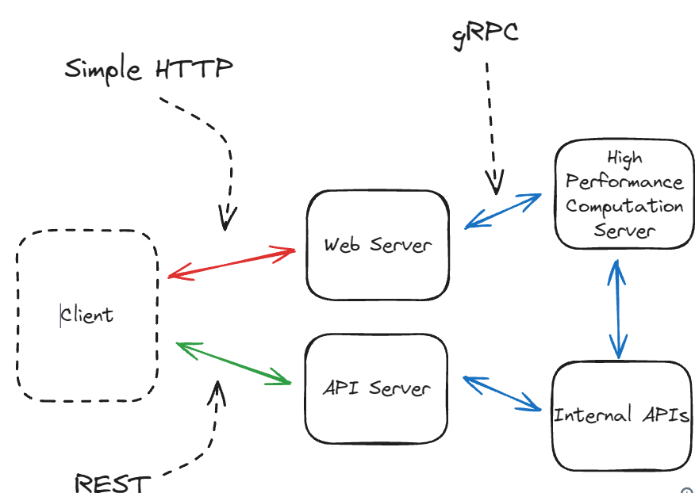

# API Design

### REST (Tree based Architecture)
* based on idea that clients are mostly performing simple operations on resources e.g files, database tables
* In RESTful API design, you set up operations that can find the requested resource and perform the requested operation
    * typically use HTTP method to identify the operation to perform
    * resources are organized into a tree structure, and they can be indentified by its path (e.g "/members/admin/id")

```Example: GET /users/{id} -> User```
* This is an operation to get a user by `id` from the resource `users`
* `id` is a path parameter

```
# Example
PUT /users/{id} -> User
{
  "username": "john.doe",
  "email": "john.doe@example.com"
}
```
* This is an operation to add a new user with `id` in the resource `users`
* everything in the brackets is the request body, which will be used to add additional details about the new user

### GraphQL
* structures API requests to fetch only specific fields and objects
* created by Facebook, now opensource

<details>
<summary>
Why use GraphQL over REST API ?
</summary>
If a client has constantly changing requirements for the data it needs to fetch from the server, GraphQL reduces the overhead of creating new queries to fulfill those requirements. It wouldn't require creating multiple new methods, the way REST APIs would. One application would be to enable a front-end team to easily make new types of queries to the backend, whenever the team creates a new page.

GraphQL is also particularly good when you want to limit the data transferred, such as for mobile apps.
</details>

```
query GetUsersWithProfilesAndGroups($limit: Int = 10, $offset: Int = 0) {
  users(limit: $limit, offset: $offset) {
    id
    username
    //...
    
    profile {
      id
      fullName
      avatar
      // ...
    }
    
    groups {
      id
      name
      description
      // ...
      
      category {
        id
        name
        icon
      }
    }
    
    status {
      isActive
      lastActiveAt
    }
  }
  
  _metadata {
    totalCount
    hasNextPage
  }
}
```

### gRPC
* Google's Remote Procedure Call
* uses HTTP/2 and Protocol Buffers
* supports streaming

#### Example Protocol Buffer Definition for `User`:
```
message User {
  string id = 1;
  string name = 2;
}
```
#### Example gRPC service definition for UserService
```
message GetUserRequest {
  string id = 1;
}

message GetUserResponse {
  User user = 1;
}

service UserService {
  rpc GetUser (GetUserRequest) returns (GetUserResponse);
}
```
#### Why use gRPC over JSON + HTTP
* more efficient than sending JSON over HTTP (~10x thoroughput)
* has strong typing which helps catch errors at compile time rather than runtime
* particularly good for service-to-service internal communication where performance is critical or latencies are dominated by the network

#### Why not use gRPC over JSON+HTTP
* not widely adopted, so can't be certain clients will support it
* web browsers in general don't support it
* not recommended for public facing APIs for now

#### Example of using gRPC in System Design


