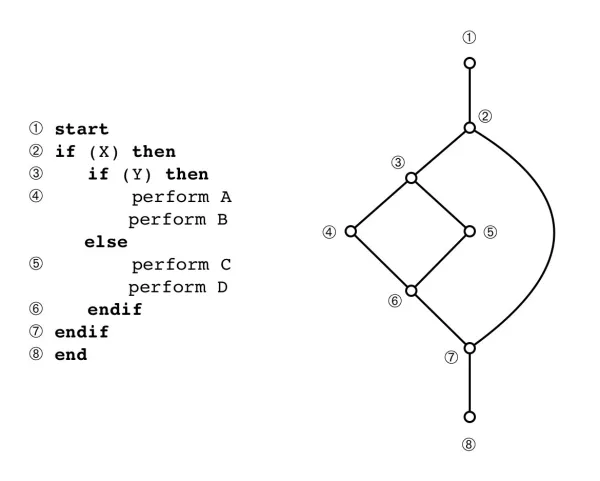

# Code Complexity
* Analyze complexity in terms of cognitive capacity required to understand and maintain code
* Particularly relevant when coding in teams, or when you need to explain solutions in coding interviews

### Reasons to Aim for low code complexity
* code is more readable for colleagues and interviewers
* code is easier to explain
* code is easier to debug and troubleshoot
* code is less likely to have hidden edge cases due to having less possible logical paths
* code is easier to update without breaking original functionality

### Ways to Measure Code Complexity
* [Cyclomatic Complexity](#cyclomatic-complexity)

## Cyclomatic Complexity
* count number of linearly independent paths through a program

### How to Calculate yourself
* draw a control flow graph while using the following formula:
$$
M = E - N + 2P \\\\
M = cyclomatic~complexity\\\\
E = number~of~edges \\\\
P = number~of~connected~components \\\\
$$

Basic rules for calculating:
1.  1 is the base complexity of a function (a single piece of code is one connected component, so P = 1)
1. +1 for each `if`, `for`, `while`, `case`, `&&` or `||`
1. multiply by the number of nested statements that satisfy #2 



For the above code segment, the cyclomatic complexity is 3.
* 1 for base complexity, P = 1
* 1 for outer `if` statement
* 1 `if` and 1 `else` statement nested
* 1 + 1*2 = 3
* Using the formula it would be: 9-8+2*1 = 3

### How to Calculate with computer
```
python -m mccabe my_code.py
```

## Resources
[Codacy](https://blog.codacy.com/code-complexity)


