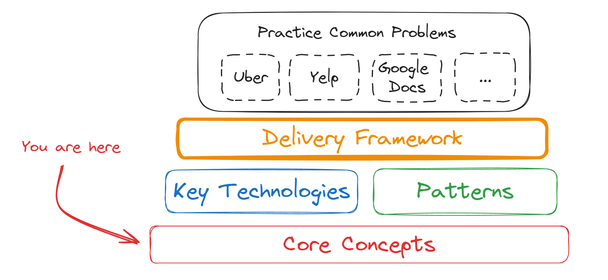

# System Design

### What are System Design Interviews?
* assess how you take an ambiguous, high level problem and break it down into infrastructure you can implement to solve said problem
* interviewers evaluate on
    * problem navigation
    * solution design
    * technical excellence: familiarity with the capabilities and limitations of relevant technologies
    * reason about tradeoffs
    * communicate ideas clearly
    * collaboration: able to integrate suggestions and feedback gracefully, responsive to questions
* most commonly seen in mid-level to senior level job interviews

### Types of System Design Interviews
* Product Design
* Infrastructure Design
* Objected Oriented Programming (OOP/Low-level) Design
* Front-end Design
* ML Infra Design
* Applied ML System Design

## Evaluation Template

### Problem Navigation (Most Important Part)

#### Expectations
* break down problem into smaller, more manageable pieces 
* flesh out each piece, prioritizing the most important parts 
* then put them together to form a solution

#### Common Pitfalls
* not exploring the problem enough and gathering the requirements
* focus on insignificant aspects of the problem, instead of the most important ones
* getting stuck on a problem, and not moving forward
* failing to deliver a working system

## Studying

### Basic Roadmap for Learning System Design

## Resources
[Hello Interview](https://www.hellointerview.com/learn/system-design/in-a-hurry/introduction)
